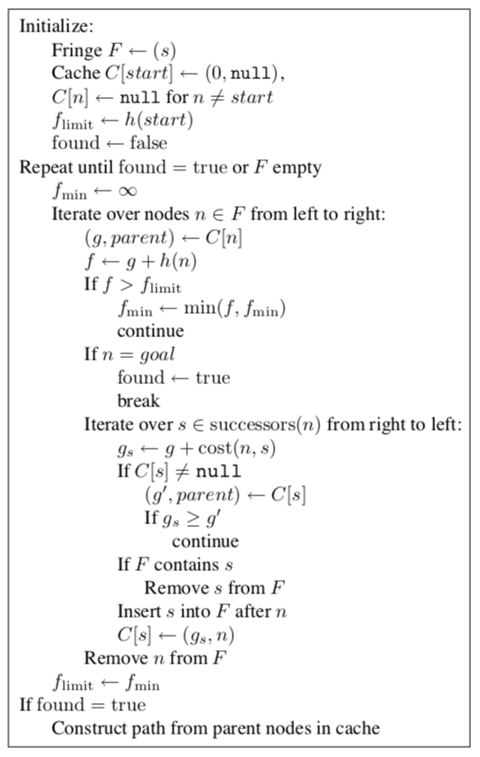

# Fringe search

#### Authors
Konrad Kucharczyk, Iga Słotwińska

Project for JPS subject implementing fringe search metaheuristics and graph structure in Scala. 

#### Docs [[click](src/main/scala/target/scala-2.12/api/lib/index.html)]

#### Sources
For the research we read publication 'Fringe Search: Beating A* at Pathfinding on Game Maps' [[click](https://webdocs.cs.ualberta.ca/~games/pathfind/publications/cig2005.pdf)].

#### Pseudocode
Implemented later with functional programming paradigm.

#### Architecture
Two main classes:
- Graph implementing endless graph structure
- FringeSearch implementing fringe search algorithm

And tests checking the corectness of written code.
